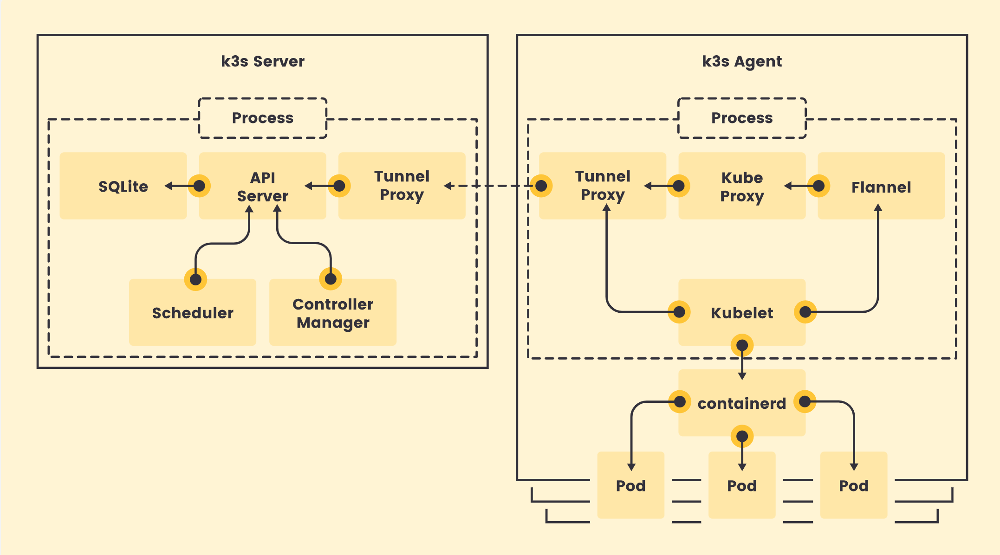

# 3.3 架构介绍

## 架构总述
K3S 是轻量化的 kubernetes 解决方案，其设计的主要目标，是在资源有限(如边缘节点)环境下，仍可以良好地运行 kubernetes 集群，并管理 workloads。为了达成这个目标，K3S 需要解决/满足:
- 以极简、快速的方式打包、部署
- 降低平台资源占用
- 适应边缘场景下不够安全和稳定的网络环境
- 实现边缘场景下的高可用(HA)

这些既是 K3S 需要解决的问题，也是 K3S 区别于 kubernetes 的主要特点。除此之外，k3s 还需要尽可能地保证与 kubernetes 一致的使用体验。整体架构如下:

K3S 将运行控制平面组件所在的节点称为 server，而不运行控制平面组件的节点称为 agent，与 kubernetes master/node 类似。上图描述了组件之间的依赖关系/流量走向，而实际部署时，server 和 agent 也都会有 kubelet、容器运行时和 kubeproxy，不管节点扮演的是什么角色，都可以在其上调度和管理Pod。

K3S 中包含了我们所熟悉的 kubernetes 的各个组件，如  kubernetes kube-apiserver, kube-controller-manager, kube-scheduler 等，为了能做到"极简、快速地打包、部署”, K3S 将上述组件都集成在一个二进制包中(<100MB)，并还在其中增加了集群必须的一些元素，如 CNI(默认为 flannel)、containerd，通过安装脚本，能在几秒钟之内得到一个完全成熟/可用的 Kubernetes 集群。

为了保持与 kubernetes 一致的使用体验，且快速地响应上游项目的升级，在代码层面，K3S 大部分直接引用了上游项目的代码，仅引入了少量的改动(如 kubernetes patchs 在 https://github.com/rancher/kubernetes *-k3s* tags 下)。

为了能降低平台资源占用，K3S 去除了 Kubernetes 中的可选组件、部分插件、云服务商 API 等，如所有 third-party 存储插件，这些被删除部分对于 K3S 来说往往也是臃肿而不必要的。除此之外，K3S 还默认使用 SQLite 替换了 ETCD。我们都知道 kubernetes 中各个组件都是通过 client-go/informer 机制 list/watch 资源，而关系型数据库通常都没有类似的 watch 机制，为了解决这个问题，rancher 开发了 kine(https://github.com/k3s-io/kine)项目，kine 作为 ETCD shim，使关系型数据库也能兼容 ETCD API，从而可以直接将关系型数据库作为集群的 storage backend。需要注意的是，SQLite 并非分布式数据库，为了高可用，用户还可选择 Mysql、Postgres 作为 storage backend，这些目前 K3S 都已支持。

边缘场景下，网络往往是不够安全和稳定的，而 server 和 agent 之间却需要很多实时的通信，如 apiserver 需要访问 kubelet 10250 端口，完成 exec/attach pod 等操作，kubelet 侧也需要通过 client-go 访问 apiserver，获取最新的资源信息。K3S 在网络上做了两点增强: K3S 提供了 tunnel-proxy，在 server 和 agent 之间搭建了 websocket 协议的通信通道，该通道主要是为了代理 apiserver 访问 kubelet 的请求，如 exec/attach/logs 等操作，从而在 kubelet 并不需要对外直接将 10250 这样端口暴露到 0.0.0.0 上; 另一方面，K3S 还会在 agent 端提供 tcp-proxy，对 apiserver 的 endpoints 进行负载均衡。