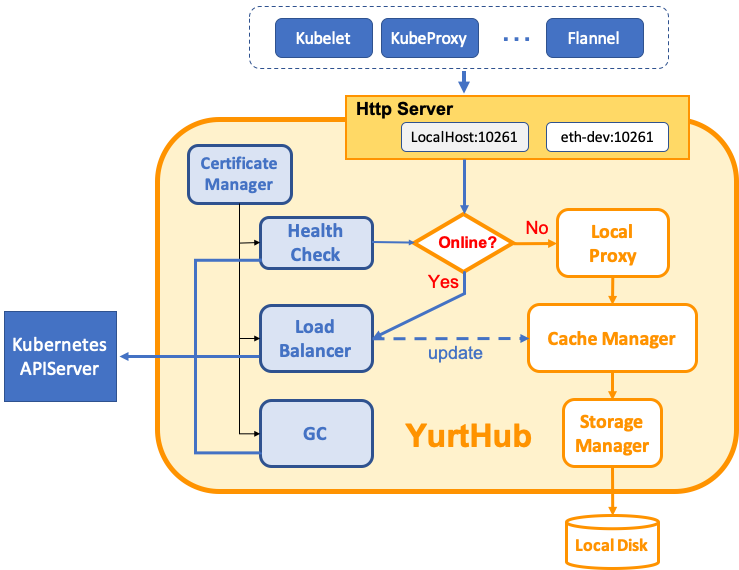
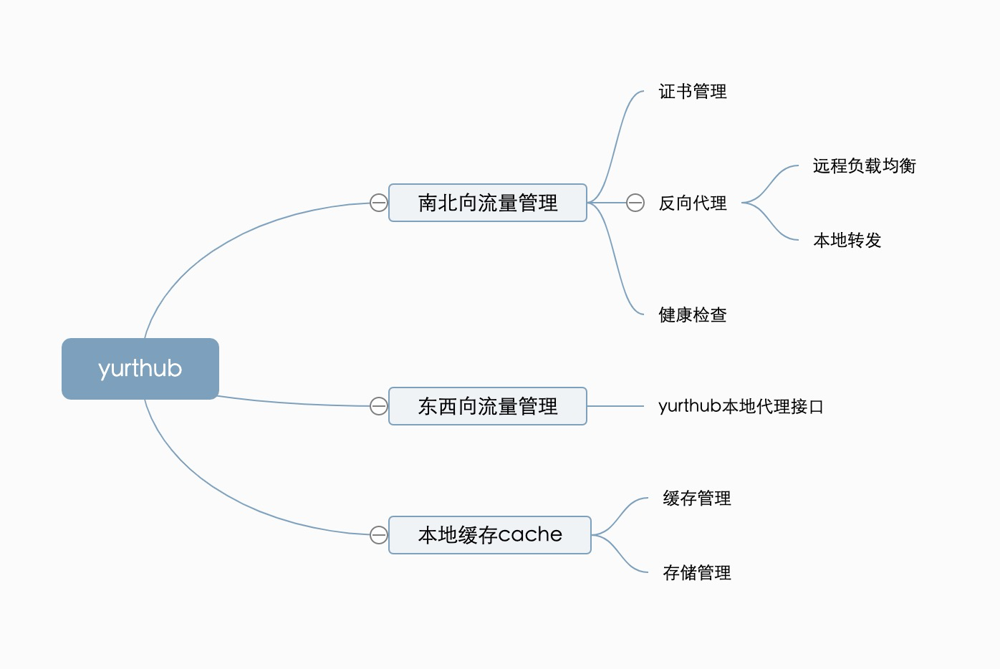

# 5.3 yurthub 源码分析


本章节将从yurthub 的架构，源代码，流程图等来分析 yurthub 的实现

具体功能

​    YurtHub是一个节点守护进程，它支持每个边缘节点的节点自治。当集群边缘网络建立时，它将必要的APIServer对象的状态缓存到本地存储中。在边缘节点离线的情况下，YurtHub保证该节点中所有注册的组件都可以访问缓存的APIServer对象状态，假装APIServer仍然是活的。

​    也就是说YurtHub提供了一种弱网环境的解决方案，即使网络不稳定造成和中心节点失去连接，健康检查依旧在进行，并且应用依然可以访问到APIServer的数据。

​    架构图摘自openyurt官网

1.架构




2.组件说明

1. http server: 根据边缘节点和云端APIServer的网络情况，将所有发送到本地接口的请求代理转发到相对应的接口
2. Load balancer: 本身作为一个负载均衡的组件，转发请求到多个APIServer服务的其中一个。调度算法支持轮训，基于优先级的路由
3. Ceph Manager:提供管理本地存储数据的接口。数据将在获取到云站点的响应请求的时候更新，并且在脱机的情况下，将由 Local Proxy 读取到数据并将缓存的数据返回。如果是在线情况下，从远端读取数据
4. Certificate Manager: 为所有需要访问云站点APIServer的组件管理客户端的证书，例如，yurthub可能使用kubelet生成的证书和cloud site APIServer进行通信
5. Health Check: 周期性的检查边缘节点和云站点的网络的连接性


3.源码分析

3.1 关于目录结构的分析

➜  openyurt git:(master) ✗ tree cmd/yurthub 

```
cmd/yurthub
├── app
│   ├── config
│   │   └── config.go  YurtHub 日志的定义
│   ├── options
│   │   └── options.go  YurtHub Flag的定义及渲染
│   └── start.go  使用cobra的风格定义YurtHub的启动方法
└── yurthub.go   YurtHub 进程的入口
```

➜  openyurt git:(master) ✗ tree pkg/yurthub 

```
pkg/yurthub 
├── cachemanager 包括 cache_agent , cache_manager , storage(具体的实现在 storage/disk)
│   ├── cache_agent.go  CacheManager

│   ├── cache_agent_test.go
│   ├── cache_manager.go 定义了cache_manager接口及实现
│   ├── cache_manager_test.go
│   └── storage_wrapper.go 定义了存储的封装，具体缓存到磁盘的实现
├── certificate
│   ├── certificate.go 
│   ├── certificate_test.go
│   ├── hubself
│   │   └── cert_mgr.go  定义了YurtHub的证书管理方法
│   ├── interfaces
│   │   └── interfaces.go  定义了证书接口，包含Update,GetRestConfig,GetCaFile,NotExpired
│   └── kubelet
│       ├── cert_mgr.go  定义了kubelet的证书管理方法
│       └── cert_mgr_test.go
├── gc
│   └── gc.go  定义了清理storage的方法，一种是pod，一种是event，实现比较容易，暂时不作为主要解读
├── healthchecker
│   ├── fake_checker.go  只返回健康，若配置此模式
│   ├── health_checker.go  节点健康检查的基本方法
│   ├── health_checker_test.go
│   ├── node_lease.go  节点租约的创建，更新，备份等方法
│   └── node_lease_test.go
├── kubernetes
│   └── serializer
│       └── serializer.go  全局序列化器
├── metrics
│   └── metrics.go  定义普罗米修斯的 metrics接口
├── proxy
│   ├── local  代理到本地缓存
│   │   ├── local.go
│   │   └── local_test.go
│   ├── proxy.go  定义了反向代理的实现方案
│   ├── remote
│   │   ├── loadbalancer.go  根据负载均衡的配置，代理到符合条件的中心apiserver
│   │   ├── loadbalancer_test.go
│   │   └── remote.go  代理到中心云apiserver的实现方案
│   └── util
│       ├── util.go  抽象出去了一些基本方法，比如获取content-type
│       └── util_test.go
├── server
│   ├── certificate.go  提供证书更新接口
│   └── server.go  定义并启动 yurthub server
├── storage
│   ├── disk  定义后端存储的disk方案
│   │   ├── storage.go
│   │   └── storage_test.go
│   ├── factory
│   │   └── factory.go  目前只有disk的方案
│   └── store.go  定义了一个接口，为了以后的扩展方便
├── transport
│   └── transport.go  维护apiserver之间的连接
└── util  一些工具类
    ├── connrotation.go
    ├── util.go
    └── util_test.go


```

根据组件概况可以分析得出结论，yurthub由3部分构成

1.是南北向流量控制管理，包括证书管理，负载均衡，健康检查

2.是东西向流量管理，包括HttpServer（拦截其他需要访问站点apiserver的组件）,以及针对

3.是本地缓存cache，包括 CacheManager组件，Storage Manager组件



下面依次分析以上三部分，结合具体代码流程来讲解实现

1.南北向流量控制

反向代理模块：


定义：

```go
type yurtReverseProxy struct {
	resolver            apirequest.RequestInfoResolver
	loadBalancer        remote.LoadBalancer
	localProxy          *local.LocalProxy
	cacheMgr            cachemanager.CacheManager
	maxRequestsInFlight int
	stopCh              <-chan struct{}
}

```

