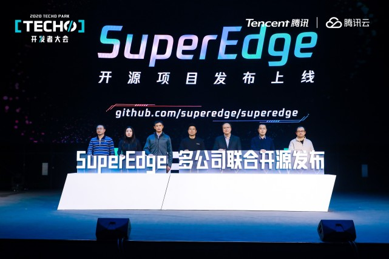

# 6.1 SuperEdge概述

[SuperEdge是腾讯2020年11月20日，在腾讯Techo Park 开发者大会上宣部由腾讯云联合英特尔、VMware威睿、虎牙、寒武纪、美团、首都在线，共同发布的边缘容器开源项目](https://tech.qq.com/a/20201220/003637.htm)。

-   项目官网：http://superedge.io

-   项目地址：https://github.com/superedge/superedge

-   项目定位

    **SuperEdge是基于原生Kubernetes的分布式边缘云容器管理系统，它把Kubernetes强大的容器管理能力无缝的扩展到边缘计算场景中**，可以实现分布式边缘云中心统一管控、边缘设备简单的接入、边缘应用中心一键分发……能力，为多地域边缘云、众多边缘设备和应用中心统一管控提供了强有力的支持。

-   和TKE Edge的关系

    TKE Edge是SuperEdge的商业版本，分为[TKE Edge公有云版本](https://cloud.tencent.com/document/product/457/42889?from=copy)和[TKE Edge私有化版本](https://cloud.tencent.com/product/iecp)，目前SuperEdge只开源了TKE Edge的边缘能力组件，其中心管控能力和集群创建能力要使用其商业版本。

    TKE Edge公有云版本用户可登录 [腾讯云容器服务控制台](https://console.cloud.tencent.com/tke2)，选择左侧导航栏中的【边缘集群】创建边缘集群，可添加自己的任意位置的边缘节点体验其边缘能力。

    TKE Edge私有化版本被封装成了一个Addon，可以helm一键化集成到用户的Kubernetes集群，进行边缘集群的创建、边缘节点的添加和边缘应用的管理。其中腾讯的[边缘计算物理网平台IECP](https://cloud.tencent.com/product/iecp)已经集成了其边缘能力，可进行其私有化的交付。

-   解决的问题

-   特色的能力

    
