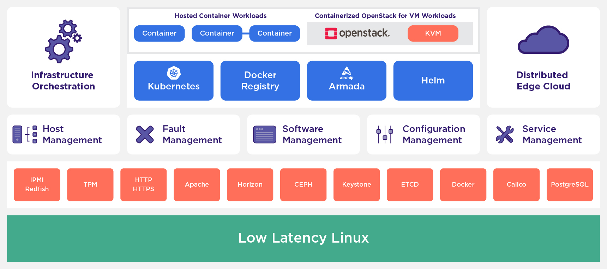

# 8.1 starlings概述

### 简要

    StarlingX的官方网站是是 [https://www.starlingx.io/](https://www.starlingx.io/) , 此网站清楚的介绍了StarlingX的现状，用途。StarlingX是完整的云基础设施软件技术栈，用于工业物联网，电信，视频交付和其他超低延迟用例中条件最苛刻的应用程序的场景里。由于边缘应用必须具备低延迟，以及使分布式边缘节点可管理的工具，StarlingX为边缘解决计算的实现提供了一个基于容器的基础设施，可伸缩的解决方案，并且现在已经可以投入生产，总架构图如下图所示。

    StarlingX虚拟化平台专注于易于部署，低触控管理性，快速响应事件以及快速恢复。因为虽然edge是一个不稳定的区域，但更加需要对这种区域进行管理及操控。对网络的操控，对设备的操控，对虚拟机的操控。

    StarlingX没有为边缘用例提供参考平台或者区别定义，而是提供了一个可部署，可拓展，高度可靠的边缘基础设施软件平台来构建重要的边缘云。StarlingX作为一个完整的堆栈进行了完整的测试和发布，并确保不同开源组件之间的兼容性。其独特的组件提供了错误管理及服务管理，以确保达到高可靠的用户程序的要求。并且StarlingX社区针对安全性，低延迟，高可靠等都提供了优化手段

### 用例介绍

