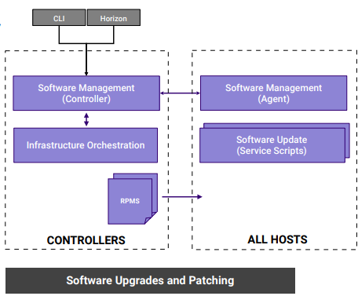

# 8.3.2 Software Updates

主要是有如下几个特征

* 为安全性和新功能的自动部署更新软件
* 集成端到端的滚动升级方案
  * 自动的，只需要少量步骤
  * 不需要额外的硬件支持
  * 跨界点滚动更新
* 增加in-service 和 需要重启的patche的支持
  * 替换内核需要重启
  * VM热迁移用于需要重启的补丁
* 管理所有软件的升级
* 包括镜像的变更
* 新增/升级 StarlingX的服务软件

此架构也是分布式，主从结构，主要的用途是进行软件的更新和patch的合入

