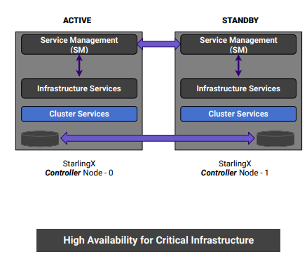

# 8.3.3 High Availability

高可用管理

* 高可用框架冗余模型可以是 N+M 或者 N 的跨多个节点
* 下图所示的是 1+1 高可用控制集群

使用多消息通道来避免脑裂故障

* 多达3条独立的通信路径
* LAG也可以配置为每条路径的多链路保护
* 较高的安全性，消息使用加密认证

主动被动的监控服务的状态

允许指定服务失败所造成的影响

如架构图所示，SM的主要功能就是一个，保证所有service的高可用，这样一来就引出了两个需要实现的功能 一个是管理服务单元，第二是具备自有的选主机制。这两点的具体实现后面剖析部分来讲。

