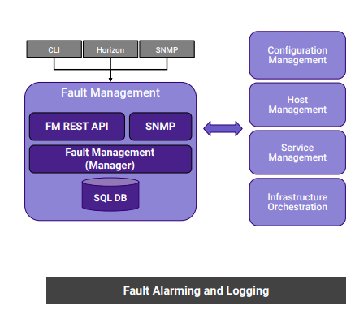

# 8.3.4 Fault Management

FM主要提供给的是上报告警，上报事件。可对接上层告警系统。

有如下几种特点

基于API的基础设施服务框架

* 设置，清楚与查询自定义的告警
* 针对重要的事件生成自定义的日志

维护当前的告警列表

提供 REST API 

支持告警抑制

操作告警

* 针对平台的节点及资源
* 针对纳管的虚拟资源

操作的记录日志 类似于审计

* 设置/清楚告警的日志
* 与平台节点和资源相关
* 与那关的虚拟资源相关

分析以上架构图可以得知，FM是属于其他组件的依赖组件，其作用是将当前系统可能有的告警及重要事件推送给客户端，也就是CLI HORIZON SNMP. 组件之间的协议为SNMP网管协议。

