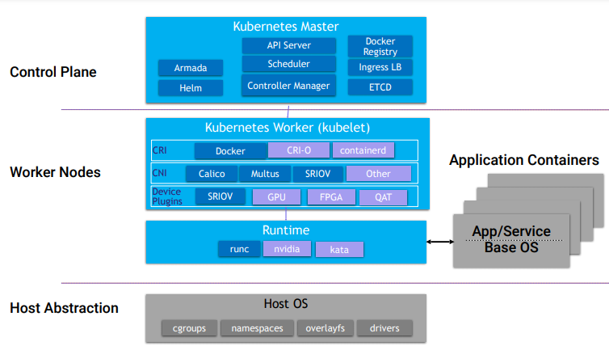

# 8.3.9 Kubernetes软件组件

K8S基本架构

* 分为k8s Master节点及 k8s Worker节点
* Master存储有站点持久化数据，功能上管理所有worker节点，安装应用app等
* Worker节点主要是提供实际虚机运行环境，包括网络，存储，计算等资源的提供
* 容器运行时目前的starlingx是支持kata的

K8S部署架构

* k8s使用一套高可靠的配置方案

* 使用1:1的服务模式进行部署

* 请求通过集群浮动ip路由到主服务器上

* DRDB备份文件系统用于冗余持久化存储

* 服务的可用性可靠性通过SM来保证

* SM主动健康主机，服务，网络可靠性

* 减轻脑裂的场景

  

K8S持久化存储

* ceph 再一个统一的系统中 独立完成 对象，块，文件系统的交付
* 为了数据副本数而高可扩展，高可用性的部署ceph 分布式monitor,osd。
* K8S的持久化存储是由 CEPH的 RBD来提供的
* openstack的后台存储使用ceph:glance,cinder,swift,nova