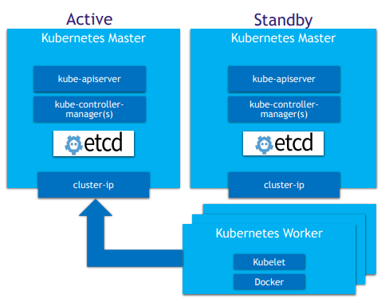
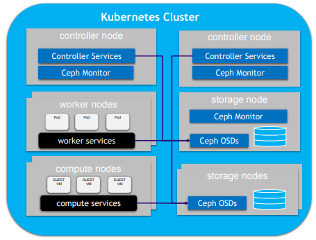

# 8.3.9 Kubernetes软件组件

K8S基本架构

* 分为k8s Master节点及 k8s Worker节点
* Master存储有站点持久化数据，功能上管理所有worker节点，安装应用app等
* Worker节点主要是提供实际虚机运行环境，包括网络，存储，计算等资源的提供
* 容器运行时目前的starlingx是支持kata的

K8S部署架构

* k8s使用一套高可靠的配置方案

* 使用1:1的服务模式进行部署

* 请求通过集群浮动ip路由到主服务器上

* DRDB备份文件系统用于冗余持久化存储

* 服务的可用性可靠性通过SM来保证

* SM主动健康主机，服务，网络可靠性

* 减轻脑裂的场景

  

K8S持久化存储

* ceph 再一个统一的系统中 独立完成 对象，块，文件系统的交付
* 为了数据副本数而高可扩展，高可用性的部署ceph 分布式monitor,osd。
* K8S的持久化存储是由 CEPH的 RBD来提供的
* openstack的后台存储使用ceph:glance,cinder,swift,nova

K8S集群网络-calico简介

* calico为容器提供一个纯L3的网络互联方案

* calico利用Linux 内核实现路由和策略

* calico利用BGP协议做控制平面

* calico利用了开放标准和一整套开源网络解决方案

* calico 是高可拓展，并且从操作和协议上来说都是友好的

* 无其他负载，没有隧道，没有VRF表，知识纯路由

  

K8S网络加速

* 使用了多网卡方案，SR-IOV，DPDK （关于多网卡的介绍https://zhuanlan.zhihu.com/p/145985580）（关于SR-IOV的介绍https://zhuanlan.zhihu.com/p/91197211）（关于DPDK的介绍https://blog.csdn.net/oldboy_1983/article/details/79474750）
* K8S管理加速网络设备，通过设备和CNI插件
* 容器直接绑定驱动到VF或者DPDK设备
* SRIOV不涉及主机路由交换，提供最好的直接IO

