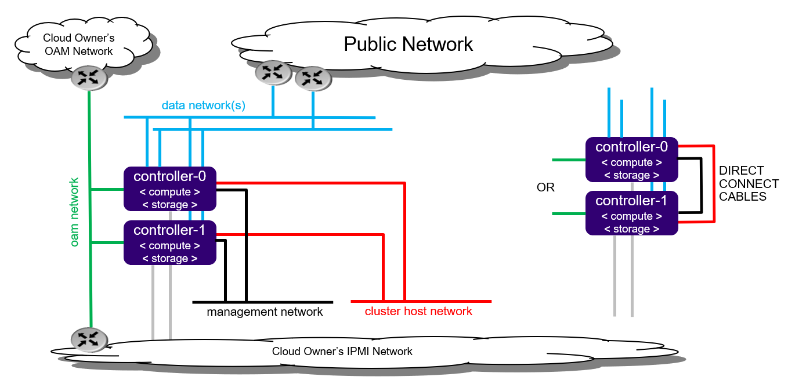

# 8.5.2 All-in-one Duplex

All-in-one Duplex部署模式提供了一对高可用（ha）服务器，每台服务器都提供了所有的三种云功能（controller控制，计算及存储）

此模式较Simplex的优势是：

1. HA业务运行在两个物理服务器的控制器之上，以主/主，或主/备的模式运行
2. 使用跨两台服务器的双node CEPH部署方案
3. 容器及虚拟机同时在两个工作节点上调度
4. 可防止单服务器发生故障，所有的控制节点的服务都将在健康的服务器上工作
5. 所有的虚拟机也将在正常的服务器上面恢复

